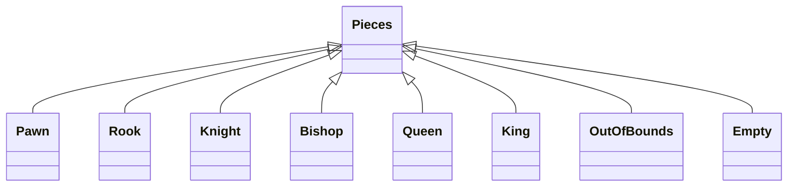

# chess-with-dislocations

## goals:
implement a game of chess where the board can also be moved, the player can either make a legal chess move, or shift the chess board by one tile, the board must always be attatched to the main board  and the board cannot move into check.

there should also be an ai where the computer can also make a move, that it calculates to be the best move (within reason, limit number of moves ahead it thinks to reduce calc times), it should both think about the traditional and extended moves.

## implementation
the board shoud use OOP patterns to reduce code redundancy i.e. have a class for pieces and have each peice as a child class, this means that the data that is shared by all pieces is not repeated and the unique methods to each piece are held induvidualy 

