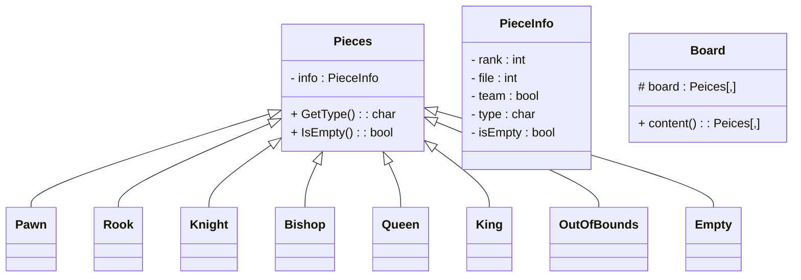

# chess-with-dislocations

## goals:

a game of chess where the board can also be moved, the player can either make a legal chess move, or shift the chess board by one tile, the board must always be attatched to the main board  and the board cannot move into check, if the move is found to be illegal the player should be reprompted to make a correct move

there should also be an ai where the computer can also make a move, that it calculates to be the best move (within reason, limit number of moves ahead it thinks to reduce calc times), it should both think about the traditional and extended moves 

there should also be a mode such that both sides are player controled

there should be a clear and intuitvive interface for the end user, preferably with a grapical interface

the board should be stored in an object where there is a  22x22, 2d array, the pieces could either be represented by a character and the move piece function could check the type of piece and store all possible moves or there could be a pieces class where there are subclasses for each piece where the move will be passed to the subclass so that the program can work in a more effective manner

## implementation
the board shoud use OOP patterns to reduce code redundancy i.e. have a class for pieces and have each peice as a child class, this means that the data that is shared by all pieces is not repeated and the unique methods to each piece are held induvidualy 

a struct is also implemented to hold important information about the peice in a logical format

## grapical interface
as part of this project i will be implementing a grapical user interface, it should be intuitve to the user and allow for easy to learn gameplay 
## engine
the program should have both modes for player vs player and computer vs player gameplay, and should have an engine that can decide moves based on the position of the game and how they will unfold in the game, it should balance how good the move is with how long it takes to calculate
